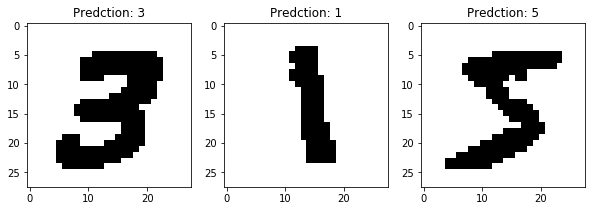
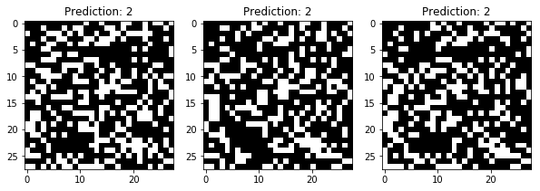

# Generating-samples-using-RL

This project was loosely inspired by a paper in chemistry titled Optimizing distributions over molecular space. An Objective-Reinforced
Generative Adversarial Network for Inverse-design Chemistry.

